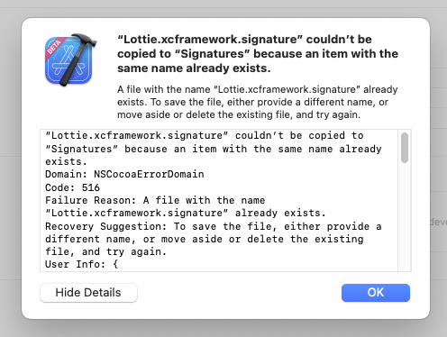

# Duplicated Signature Issue Reproduction Project

Since first version of Xcode 15, and even with the latest beta 4, when a project that contains
a reference into a `.xcframework` binaryTarget is archived, the following error appears, blocking the release process:

> “Lottie.xcframework.signature” couldn’t be copied to “Signatures” because an item with the same name already exists.

##  Xcode project Setup

- Cocoapods based project
- Local Swift Package (`libraries` directory) with a binary example dependency (Lottie, but it could be any other one)
- Development Pod with a Swift Package Manager local dependency
- Xcode 15
- Cocoapods 1.12.1
- Ruby 3.1.4

## How to reproduce

1. Open the `TestProject.xcworkspace`

3. Choose `Library1` scheme

4. Go to  `Product - Archive`

5. The failure related with signatures will happen.

    

However, if you choose `MyFramework` scheme and repeat the same steps the problem is not reproducible, when both targets contain the same SPM binary dependency (Lottie).

